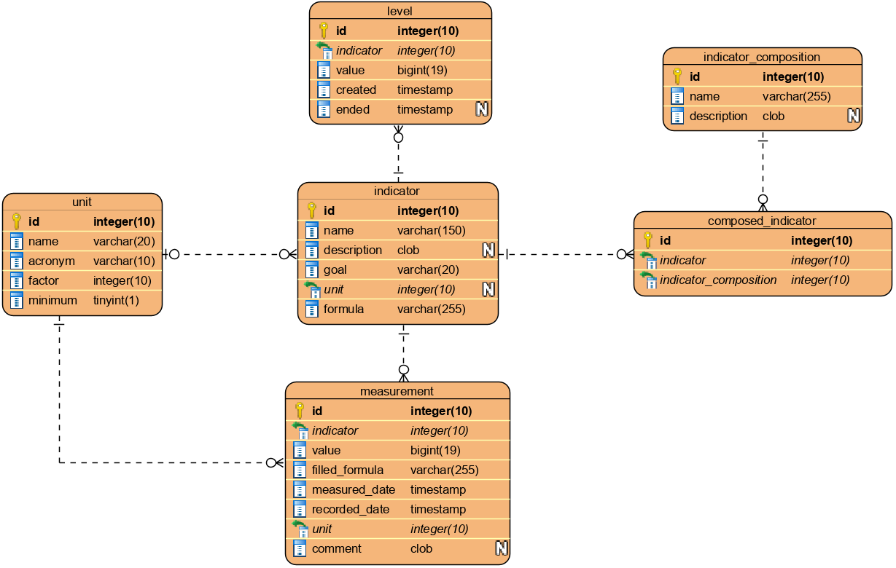

# Controlato

To install PostgreSQL:

    $ sudo apt-get install postgresql

    $ sudo su - postgres -c "createuser -s $USER"
    $ createdb controlato
    $ createuser controlato -P // Inform the password 'controlato' when asked for.
    $ psql -d controlato
      =# grant connect on database controlato to controlato;
      =# revoke connect on database controlato from public;
      =# alter user controlato createdb;
      =# \q

    $ sudo apt-get install curl ca-certificates gnupg
    $ sudo https://www.postgresql.org/media/keys/ACCC4CF8.asc | sudo apt-key a dd -
    $ lsb_release -c
    $ sudo sh -c 'echo "deb http://apt.postgresql.org/pub/repos/apt/ $(lsb_release -cs)-pgdg main" > /etc/apt/sources.list.d/pgdg.list'
    $ sudo apt-get update
    $ sudo apt-get install pgadmin4

To install Elixir:

    $ sudo apt-get install elixir 
  
To install other dependencies required by the project:

    $ sudo apt-get install erlang-inets erlang-dev erlang-parsetools inotify-tools gettext npm

To start your Phoenix server:

  * Install dependencies with `mix deps.get`
  * Create and migrate your database with `mix ecto.setup`
  * Install Node.js dependencies with `cd assets && npm install`
  * Start Phoenix endpoint with `mix phx.server`

Now you can visit [`localhost:4000`](http://localhost:4000) from your browser.

Ready to run in production? Please [check our deployment guides](https://hexdocs.pm/phoenix/deployment.html).

## Learn more

  * Official website: http://www.phoenixframework.org/
  * Ecto: https://hexdocs.pm/ecto/Ecto.html
  * Guides: https://hexdocs.pm/phoenix/overview.html
  * Docs: https://hexdocs.pm/phoenix
  * Mailing list: http://groups.google.com/group/phoenix-talk
  * Source: https://github.com/phoenixframework/phoenix
