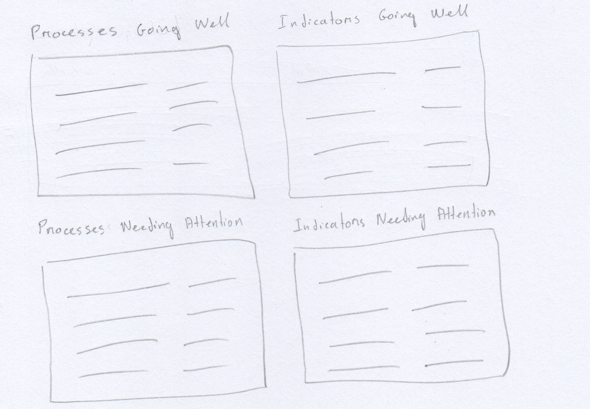
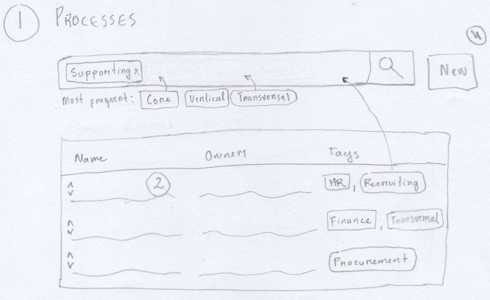
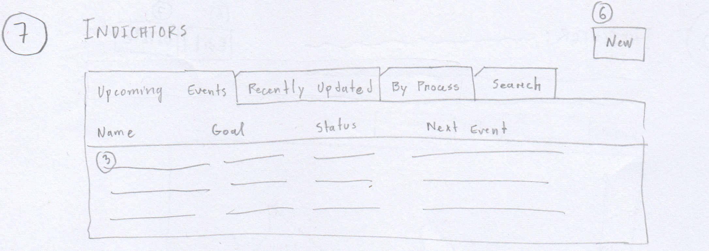
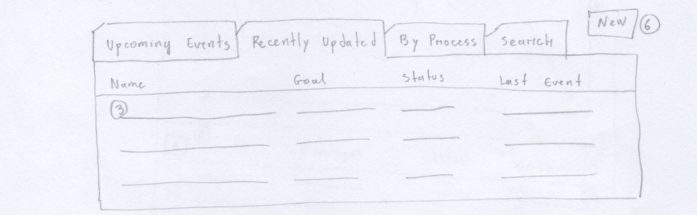
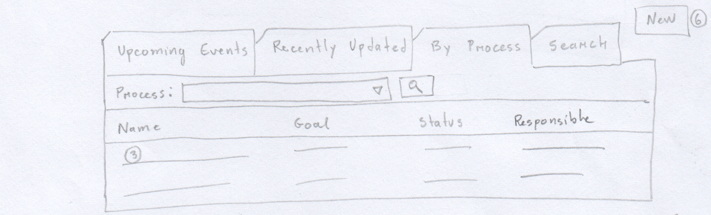
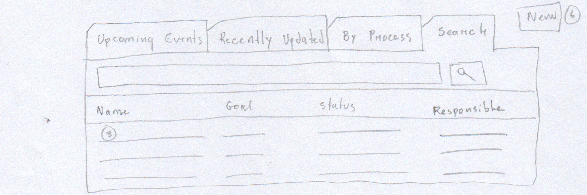

= Controlato - User Manual
Hildeberto Mendonça <me@hildeberto.com>
v0.1.0, 2018-02-25
:doctype: book
:encoding: utf-8
:toc: left
:toclevels: 4
:numbered:

:sectnums!:

== Introduction

:sectnums:

== Homepage

image::images/homepage-personal-view.png[Homepage Personal View]

== Processes

=== Process Dashboard

image::images/process.png[Process]

=== Creating and Editing a Process

image::images/process-form.png[Process Form]

== Indicators

=== Indicators With Upcoming Events

=== Indicators With Recent Events Registered

=== Indicators Filtered By Process

=== Free Search For Indicators

=== Visualizing an Indicator

image::images/indicator.png[Indicator]

=== Creating and Editing an Indicator

image::images/indicator-form.png[Indicator Form]

== Events

image::images/event-form.png[Event Form]
